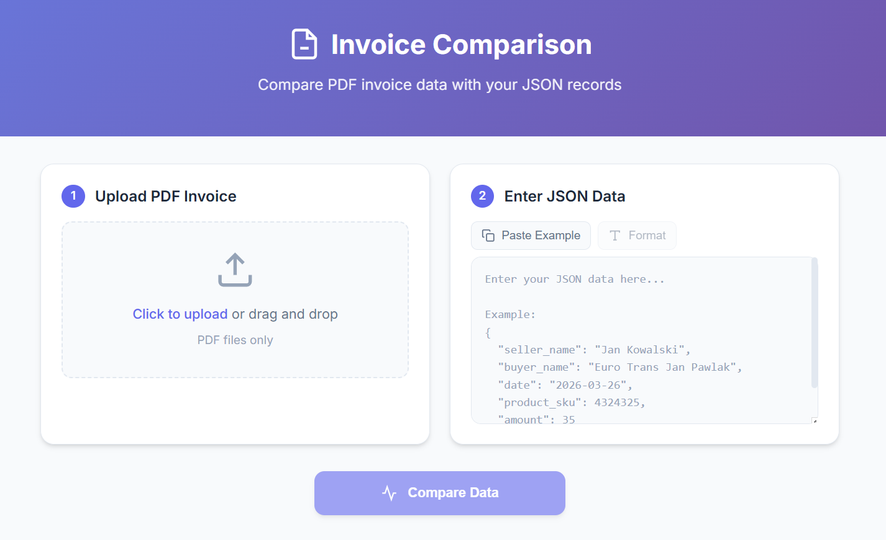

# PDF Invoice JSON Comparison Tool

Compares user-provided JSON data with data extracted from PDF invoices using Azure Document Intelligence and Azure OpenAI.



## Features

- **Modern React Frontend** - Attractive, responsive UI with drag & drop PDF upload
- Extracts structured data from PDF invoices using Azure Document Intelligence (`prebuilt-invoice` model)
- Uses Azure OpenAI to map extracted fields to your JSON schema
- Anonymizes names (keeps first 2 and last 2 characters, replaces middle with `*`)
- Generates field-by-field comparison with visual match/mismatch indicators
- REST API backend with FastAPI

## Architecture

```
├── backend/          # FastAPI Python backend
│   ├── main.py       # API endpoints and processing logic
│   └── requirements.txt
├── frontend/         # React + Vite frontend
│   ├── src/
│   │   ├── components/
│   │   └── App.jsx
│   └── package.json
└── app.py           # Original CLI version (still works)
```

## Prerequisites

- Python 3.10+
- Node.js 18+
- Azure Document Intelligence resource ([Create one](https://learn.microsoft.com/azure/ai-services/document-intelligence/create-document-intelligence-resource))
- Azure OpenAI resource with a deployed model (e.g., `gpt-4o`) ([Create one](https://learn.microsoft.com/azure/ai-services/openai/how-to/create-resource))
- Azure CLI logged in (`az login`) for keyless authentication

## Environment Variables

Create a `.env` file in the `backend/` folder (or project root). See `backend/.env.example`:

| Variable | Description | Example |
|----------|-------------|---------|
| `DOCUMENT_INTELLIGENCE_ENDPOINT` | Azure Document Intelligence endpoint URL | `https://<name>.cognitiveservices.azure.com/` |
| `AZURE_OPENAI_ENDPOINT` | Azure OpenAI endpoint URL | `https://<name>.openai.azure.com/` |
| `AZURE_OPENAI_DEPLOYMENT_NAME` | Name of your deployed model | `gpt-4o` |

## Input JSON Schema

The app expects JSON with these fields:

```json
{
  "seller_name": "Jan Kowalski",
  "buyer_name": "Euro Trans Jan Pawlak",
  "date": "2026-03-26",
  "product_sku": 4324325,
  "amount": 35
}
```

| Field | Type | Description |
|-------|------|-------------|
| `seller_name` | string | Name of the seller/vendor |
| `buyer_name` | string | Name of the buyer/customer |
| `date` | string | Invoice date (YYYY-MM-DD format) |
| `product_sku` | number | Product SKU/code |
| `amount` | number | Quantity/amount |

## Quick Start

### 1. Backend Setup

```powershell
cd backend

# Create virtual environment
python -m venv .venv
.\.venv\Scripts\Activate.ps1

# Install dependencies
pip install -r requirements.txt

# Configure environment (copy and edit)
copy .env.example .env
# Edit .env with your Azure endpoints

# Start backend server
python main.py
```

Backend runs at: `http://localhost:8000`

### 2. Frontend Setup

```powershell
cd frontend

# Install dependencies
npm install

# Start development server
npm run dev
```

Frontend runs at: `http://localhost:5173`

## Usage

1. Open `http://localhost:5173` in your browser
2. **Upload PDF** - Drag & drop or click to select your invoice PDF
3. **Enter JSON** - Paste your expected data (use "Paste Example" for template)
4. **Compare** - Click "Compare Data" and view results

## API Endpoints

| Method | Endpoint | Description |
|--------|----------|-------------|
| GET | `/` | Health check |
| POST | `/api/compare` | Compare PDF with JSON data |

### POST /api/compare

**Form Data:**
- `pdf_file`: PDF file (multipart/form-data)
- `json_data`: JSON string with expected values

**Response:**
```json
{
  "data_input": { ... },
  "data_extracted": { ... },
  "field_comparison": {
    "seller_name": { "value_input": "...", "value_extracted": "...", "match": true }
  },
  "all_match": false
}
```

## CLI Version

The original command-line version is still available:

```powershell
python app.py
```

## Output Example

```json
{
  "data_input": {
    "seller_name": "Ja********ki",
    "buyer_name": "Eu*****************ak",
    "date": "2026-03-26",
    "product_sku": 4324325,
    "amount": 35
  },
  "data_extracted": {
    "seller_name": "Ja********ki",
    "buyer_name": "Eu*****************ak",
    "date": "2024-04-15",
    "product_sku": null,
    "amount": 1
  },
  "field_comparison": {
    "date": {
      "value_input": "2026-03-26",
      "value_extracted": "2024-04-15",
      "match": false
    },
    "buyer_name": {
      "value_input": "Eu*****************ak",
      "value_extracted": "Eu*****************ak",
      "match": true
    },
    "product_sku": {
      "value_input": 4324325,
      "value_extracted": null,
      "match": false
    },
    "seller_name": {
      "value_input": "Ja********ki",
      "value_extracted": "Ja********ki",
      "match": true
    },
    "amount": {
      "value_input": 35,
      "value_extracted": 1,
      "match": false
    }
  },
  "all_match": false
}
```

## Database Integration

The output dictionary is designed for easy database insertion:

| Field | Description |
|-------|-------------|
| `data_input` | Anonymized user-provided JSON |
| `data_extracted` | Anonymized data extracted from PDF |
| `field_comparison` | Per-field comparison with match status |
| `all_match` | `true` if all fields match, `false` otherwise |

## Authentication

Uses `DefaultAzureCredential` (keyless authentication). Ensure you're logged in via:
```powershell
az login
```

## Important Notes

- **Both servers required** - The backend (port 8000) and frontend (port 5173) must run simultaneously
- **PDF format** - Upload only PDF invoices; the app uses the `prebuilt-invoice` model
- **Vite proxy** - The frontend proxies `/api/*` requests to the backend automatically
- **.env location** - Place your `.env` file in `backend/` or the project root (app checks both)

## Troubleshooting

| Issue | Solution |
|-------|----------|
| `DOCUMENT_INTELLIGENCE_ENDPOINT not set` | Ensure `.env` file exists with correct variables |
| `401 Unauthorized` | Run `az login` to authenticate with Azure |
| `Network Error` on frontend | Verify backend is running on port 8000 |
| `Invalid JSON format` | Check your JSON syntax (use the Format button) |
| Empty extraction results | Ensure the PDF is a valid invoice document |

## Production Deployment

### Build Frontend

```powershell
cd frontend
npm run build
```

Static files are output to `frontend/dist/`. Serve these with any static file server or integrate with the FastAPI backend.

### Run Backend with Uvicorn

```powershell
cd backend
uvicorn main:app --host 0.0.0.0 --port 8000
```

For production, consider using a process manager like `gunicorn` with uvicorn workers.

## License

MIT
